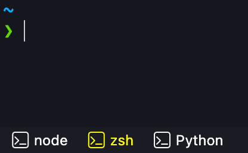

# Tabulous

Adds tabs for each terminal process to the status bar.



> Fork of
> [BenWildeman/vscode-tabulous](https://github.com/BenWildeman/vscode-tabulous)

## Workspace Configuration

Use `tabulous.defaultTerminals` in a `.code-workspace` file to define terminals
that auto-create on open:

```jsonc
{
  "folders": [
    {
      "path": "relative/to/workspace/file",
      "name": "Named Workspace"
    },
    {
      "path": "relative/to/workspace/file",
      "name": "Another Named Workspace"
    }
  ],
  "tabulous.defaultTerminals": [{
    "name": "App",
    // Could be absolute path
    "directory": "C:/absolute/path",
    "command": "npm start",
    "executeCommand": false
  }, {
    "name": "API",
    // Could be the name of the workspace folder specified within the .code-workspace
    "directory": "Workspace Folder Name",
    "command": "npm start"
  }, {
    "name": "Watcher",
    // Could be relative path. If multi-root workspace,
    // path will be relative to the .code-workspace directory, otherwise
    // it will be relative to the workspace directory
    "directory": "./relative/path",
    "command": "npm run watch",
    "executeCommand": false
  }]
}
```

---

## Contributing

Checkout the repo, ensure `bun` is on your `PATH`, install dependencies with
`bun install`, press **F5** to launch a test window with the extension loaded,
optionally test the package, commit your changes, and send a PR.

- [github.com/oven-sh/bun](https://github.com/oven-sh/bun)

```bash
bun install
bun run package
codium --install-extension tabulous-*.vsix
```

## Release Process

Automated with [googleapis/release-please-action](https://github.com/googleapis/release-please-action#how-release-please-works)

1. Pushing to `main` triggers [release.yml](.github/workflows/release.yml).
2. The workflow opens or updates a PR that bumps the version in `package.json`
   and generates a [CHANGELOG.md](CHANGELOG.md) from
   [conventionalcommits.org](https://www.conventionalcommits.org). Only `fix:`
   (patch), `feat:` (minor), and breaking changes trigger a release PR; `chore:`
   and other non-functional commits are intentionally ignored.
3. When merged, the workflow builds and distributes the package.

## Extension Evolution

1. [Tyriar/vscode-terminal-tabs](https://github.com/Tyriar/vscode-terminal-tabs)
2. [BenWildeman/vscode-terminal-tabs](https://github.com/BenWildeman/vscode-terminal-tabs)
3. [BenWildeman/vscode-tabulous](https://github.com/BenWildeman/vscode-tabulous)
4. Fork +v2 => [CHANGELOG](CHANGELOG.md)
